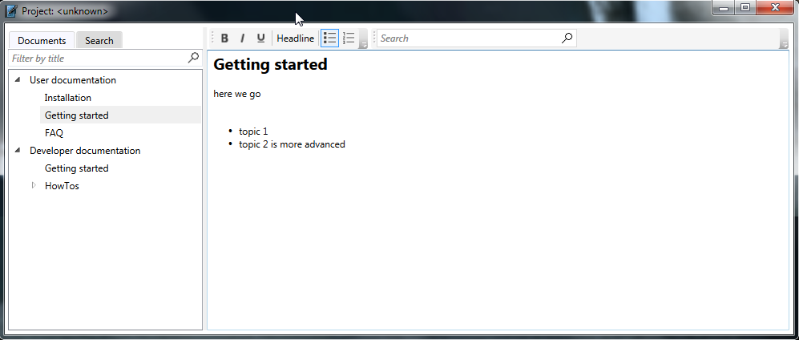

# Plainion.OneNote: ONE notebook to rule them all 

Simple WPF application based on 
[Plainion.Windows.Controls.Text.NoteBook](https://github.com/plainionist/Plainion.Windows/tree/master/src/Plainion.Windows/Controls/Text).

