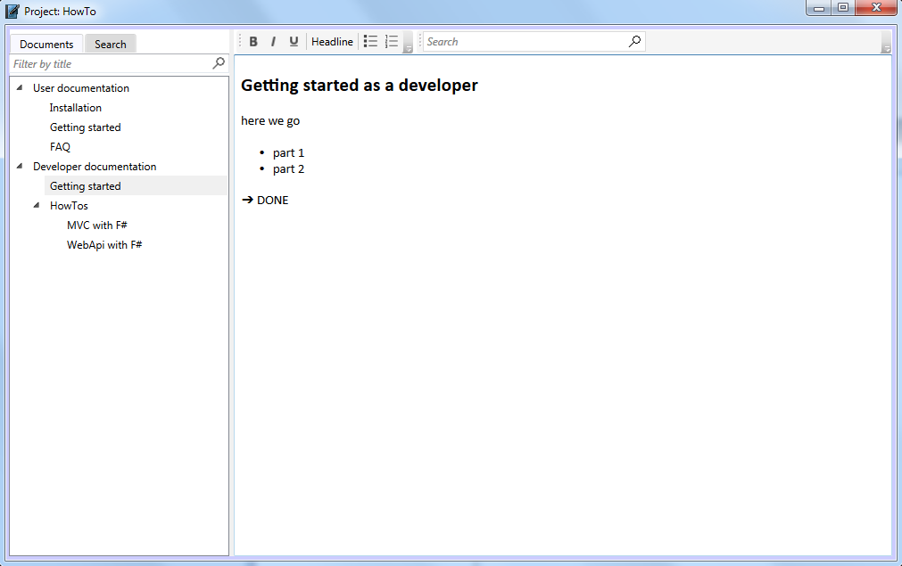

Plainion.OneNote is a notebook which allows you to structure and connect your thoughts by focusing on 
content.

It supports various autocorrectsion like
- arrows
- markdown style headlines
- markdown style bullet lists

## Installation

- download [latest release](https://github.com/plainionist/Plainion.OneNote/releases) and unpack it somewhere
- start the Plainion.OneNote.exe

## References

Plainion.OneNote is based on 
[Plainion.Windows.Controls.Text.NoteBook](https://github.com/plainionist/Plainion.Windows/tree/master/src/Plainion.Windows/Controls/Text).
